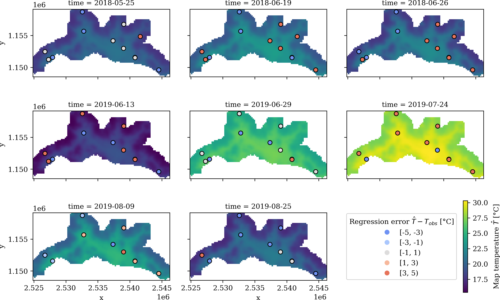

[](https://github.com/martibosch/lausanne-heat-islands/blob/master/LICENSE)

# Lausanne heat islands

A reusable computational workflow to use the InVEST urban cooling model to simulate urban heat islands, illustrated with an example application to the Swiss urban agglomeration of Lausanne.

**Citation**: Bosch, M., Locatelli, M., Hamel, P., Remme, R. P., Chenal, J., and Joost, S. 2020. "A spatially-explicit approach to simulate urban heat islands in complex urban landscapes". Under review in *Geoscientific Model Development*. [10.5194/gmd-2020-174](https://doi.org/10.5194/gmd-2020-174)



## Instructions to reproduce

The computational workflow to reproduce the results makes use of [a Makefile](https://github.com/martibosch/lausanne-heat-islands/blob/master/Makefile) which orchestrates the execution of all the steps to transform the raw data into tables and figures<sup>[1](#note-1)</sup>. To reproduce the computational workflow in your computer, you can follow the steps below:

1. Clone the repository and change the working directory to the repository's root:

```bash
git clone https://github.com/martibosch/lausanne-heat-islands
cd lausanne-heat-islands
```

2. Create the environment (this requires conda) and activate it:

```bash
conda env create -f environment.yml
# the above command creates a conda environment named `lausanne-heat-islands`
conda activate lausanne-heat-islands
```
 
3. Register the IPython kernel of the `lausanne-heat-islands` environment:

```bash
python -m ipykernel install --user --name lausanne-heat-islands --display-name \
    "Python (lausanne-heat-islands)"
```

4. You can use `make` to download the data data required to reproduce the results (which is available [at a dedicated Zenodo repository](https://zenodo.org/record/4384675)) as in:

```bash
make download_zenodo_data
```

5. Finally, you can launch a Jupyter Notebook server and generate the tables and figures interactively by executing the notebooks of the `notebooks` directory. The first cell of each notebook features a call to a target of the Makefile, which will download and process all the data required to execute the subsequent cells. The following notebooks are provided:

* [Spatial regression](https://github.com/martibosch/lausanne-heat-islands/blob/master/notebooks/spatial-regression.ipynb)
* [InVEST urban cooling model](https://github.com/martibosch/lausanne-heat-islands/blob/master/notebooks/invest-urban-cooling-model.ipynb)
* [Comparison](https://github.com/martibosch/lausanne-heat-islands/blob/master/notebooks/comparison.ipynb)

## Notes

1. <a name="note-1"></a> Many of the datasets used here are open and therefore all the processing steps can be reproduced by anyone. However, some other datasets are proprietary and thus cannot be shared openly. In the latter case, in order to allow the maximum reproducibility of our results, the following interim files are provided:

    * [`station-tair.csv`](https://zenodo.org/record/4384675/files/station-tair.csv?download=1): temperature measurements at the monitoring stations for the reference dates
    * [`ref-et.nc`](https://zenodo.org/record/4384675/files/ref-et.tif?download=1): reference evapotranspiration raster for the reference dates
    * [`bldg-cover.tif`](https://zenodo.org/record/4314832/files/bldg-cover.tif?download=1): raster with the percentage of building cover in each pixel of the Lausanne agglomeration 

    The sources for the first two files are detailed [at the Zenodo repository for this paper](https://zenodo.org/record/4384675), whereas the source of `bldg-cover.tif` is detailed at [10.5281/zenodo.4314832](https://doi.org/10.5281/zenodo.4314832). If you use these files, their sources must be properly acknowledged.

## See also

* [Lausanne agglomeration extent](https://github.com/martibosch/lausanne-agglom-extent)
* [Lausanne tree canopy](https://github.com/martibosch/lausanne-tree-canopy)
* [InVEST urban cooling model calibration](https://github.com/martibosch/invest-ucm-calibration)
* [Swiss urban heat islands utils](https://github.com/martibosch/swiss-uhi-utils)

## Acknowledgments

* With the support of the École Polytechnique Fédérale de Lausanne (EPFL)
* Project based on the [cookiecutter data science project template](https://drivendata.github.io/cookiecutter-data-science). #cookiecutterdatascience
